# AI Management System (AIMS) Policy

**Document type:** Organisational Policy Template
**Author:** Dorota Wasiak
**Status:** Template - ready for organisational customisation
**Last updated:** June 2026
**Related documents:** [01-business-case.md](01-business-case.md) | [02-business-requirements.md](02-business-requirements.md)

---

> **About this document**
> This is a reusable AIMS Policy template, designed to be adapted by any organisation establishing AI governance under ISO/IEC 42001:2023. Placeholders such as `[Company Name]`, `[Date]`, and `[Name, Title]` are intentional and should be completed during organisational adoption. This template establishes the governance framework that AISIA - the AI System Impact Assessment tool also presented in this portfolio - operationalises in practice. AISIA's trigger conditions and assessment process (Section 6.4) are drawn directly from this policy.

---

## Table of Contents

1. [Purpose & Scope](#1-purpose--scope)
2. [Reference & Definitions](#2-reference--definitions)
3. [Organization Context](#3-organization-context)
4. [Roles and Responsibilities](#4-roles-and-responsibilities)
5. [AI Objectives](#5-ai-objectives)
6. [Risk and Impact Management](#6-risk-and-impact-management)
7. [Ethical Principles](#7-ethical-principles)
8. [Acceptable Use Guidelines](#8-acceptable-use-guidelines)
9. [Data Privacy and Security](#9-data-privacy-and-security)
10. [Human Oversight and Safety](#10-human-oversight-and-safety)
11. [Competence, Training and Awareness](#11-competence-training-and-awareness)
12. [Compliance and Legal Considerations](#12-compliance-and-legal-considerations)
13. [Employee Rights](#13-employee-rights)
14. [Monitoring and Improvement](#14-monitoring-and-improvement)

---

## 1. Purpose & Scope

This policy establishes the principles for the responsible and ethical design, development, deployment, and use of Artificial Intelligence (AI) systems within [Company Name].

It provides a framework for setting AI objectives and confirms the organization's commitment to meeting legal and regulatory requirements (including the EU AI Act and GDPR) and the continual improvement of the AI Management System (AIMS).

**Scope:** This policy applies to all employees, contractors, and third-party users involved in any stage of the AI system life cycle under the organization's control.

---

## 2. Reference & Definitions

Consistent with international standards and the EU regulatory framework:

- **AI System:** A machine-based system designed to operate with varying levels of autonomy and that may exhibit adaptiveness after deployment, and that, for explicit or implicit objectives, infers from the input it receives how to generate outputs such as predictions, content, recommendations, or decisions that can influence physical or virtual environments.

- **AI Management System (AIMS):** A set of interrelated or interacting elements of an organization to establish policies and objectives, as well as processes to achieve those objectives, specifically regarding AI.

- **AI System Impact Assessment:** A formal, documented process by which impacts on individuals, groups, or society are identified, evaluated, and addressed.

- **Large Language Model (LLM), Generative AI, or GenAI:** An advanced AI model trained on vast amounts of text and able to interact with human users using natural language. Examples include ChatGPT, Gemini, and Claude.

- **[Company Name]'s AI Tools:** AI-based tools approved for use by the company, along with their descriptions (documented in the form of a link to an updated file).

---

## 3. Organization Context

[Company Name] has determined the external and internal issues that are relevant to its purpose and that affect its ability to achieve the intended outcomes of its AI Management System.

[Company Name]'s AI initiatives support its strategic objectives of *[insert: e.g. operational efficiency / customer experience improvement / product innovation - to be confirmed by Top Management]*. The AIMS is designed to ensure that AI is adopted in a way that is consistent with these objectives while managing associated risks responsibly.

### Internal issues considered include:

| Factor | Description |
|---|---|
| Organizational structure | e.g. centralised / decentralised; number of business units using AI - to be defined |
| AI maturity level | e.g. early adoption / scaling / optimising - current state assessment to be completed |
| Existing governance frameworks | e.g. ISO 27001 for information security, GDPR compliance programme, existing data governance - list applicable frameworks |
| Culture and awareness | e.g. level of AI literacy across teams; appetite for innovation vs. risk aversion - to be assessed |
| Available resources and competences | e.g. in-house data science capability, legal/compliance capacity, ethics expertise - to be inventoried |
| Technology landscape | e.g. AI tools currently in use or under evaluation - reference AI Tools Register if available |

### External issues considered include:

| Factor | Description |
|---|---|
| Legal and regulatory environment | EU AI Act; GDPR; *[insert sector-specific regulations if applicable, e.g. financial services, healthcare]* |
| Market and competitive context | e.g. industry adoption of AI; customer expectations regarding AI transparency - to be defined |
| Technology trends | e.g. rapid development of generative AI; increasing availability of third-party AI services |
| Societal expectations | Growing public and media scrutiny of AI ethics, bias, and accountability |
| Third-party dependencies | e.g. reliance on external AI vendors such as OpenAI, Microsoft, Google - list key providers |

### 3.1 Understanding the Needs and Expectations of Interested Parties

[Company Name] has identified the following interested parties as relevant to its AIMS, along with their key needs and expectations:

| Interested Party | Needs and Expectations |
|---|---|
| **Employees** | Clear guidance on acceptable AI use; training; protection from AI-related decisions affecting employment |
| **Customers / End Users** | Transparency about AI use; fair treatment; ability to contest AI-assisted decisions |
| **Regulators (EU, national)** | Compliance with EU AI Act, GDPR, and applicable sector regulations |
| **AI system suppliers / vendors** | Clear requirements for responsible AI; contractual obligations |
| **Board / Top Management** | Strategic alignment; reputational risk management; legal compliance |
| **Society and affected communities** | Prevention of harm; fairness; accountability |

---

## 4. Roles and Responsibilities

The development, deployment and use of AI systems must be underpinned by clear roles and responsibilities. This includes the individuals responsible for overseeing AI projects, ensuring compliance and addressing any issues or concerns that arise. The AI Ethics Board will maintain open lines of communication with these employees and hold regular meetings to ensure that workflows align with the company's corporate strategy and ethical guidelines. [Company Name] also monitors and evaluates third-party AI tool providers (e.g., OpenAI, Microsoft) to ensure that their systems do not compromise security standards.

### 4.1 Decision-Making and Accountability

While AI can assist in decision-making, human oversight is crucial, especially in critical or sensitive areas. At [Company Name], human employees will be fully accountable for any decisions made using AI systems.

| Role | Responsibility |
|---|---|
| **Top Management** | Accountable for the overall AI policy, strategic alignment, and the provision of resources |
| **AI Ethics Board** | A multidisciplinary team responsible for overseeing projects, conducting ethical assessments, and ensuring compliance |
| **Development Teams** | Responsible for technical documentation, data quality management, and rigorous system testing |
| **System Owners** | Responsible for maintaining risk classifications, triggering impact assessments, and ensuring post-deployment monitoring for their AI systems |
| **Data Protection Officer (DPO)** | Responsible for ensuring AI-related data processing complies with GDPR; reviews and approves DPIAs where required *[Appoint if applicable]* |
| **All Employees** | Responsible for using AI tools only as permitted under this policy and reporting concerns or incidents promptly |

### 4.2 Transparency

[Company Name] is committed to a transparent decision-making process. Each [Company Name] department will develop a list of acceptable uses of AI in the context of their responsibilities. Before using AI to assist with additional tasks, employees and managers will seek approval from their department heads and, if applicable, the AI Ethics Board.

---

## 5. AI Objectives

[Company Name] establishes the following AIMS objectives in alignment with its AI Policy, business strategy, and applicable regulatory requirements (EU AI Act, GDPR). These objectives are reviewed at least annually by Top Management and the AI Ethics Board.

For each objective, [Company Name] determines: the actions to be taken, the resources to be utilised, the individuals who will assume responsibility, the timeframe for completion, and the criteria for evaluating results.

### 5.1 Regulatory Compliance

Ensure all AI systems in use comply with applicable legal and regulatory requirements, including the EU AI Act and GDPR, by *[target date]*.

| | |
|---|---|
| **What** | Conduct an AI system inventory; classify each system by EU AI Act risk category; document compliance status |
| **Who** | AI Ethics Board, Legal/Compliance, IT |
| **When** | [Date] - initial inventory; [Date] - ongoing review cycle |
| **Resources** | Internal legal review + external audit (if applicable) |
| **Measure** | % of AI systems with completed risk classification and compliance documentation |

### 5.2 Bias and Fairness

Reduce the risk of discriminatory outcomes from AI systems by implementing regular bias testing for all high-risk AI applications.

| | |
|---|---|
| **What** | Define bias testing criteria per use case; conduct baseline assessment; implement corrective actions |
| **Who** | Development Teams, AI Ethics Board |
| **When** | [Date] - criteria defined; [Date] - first assessments completed |
| **Resources** | Data quality tools, internal data science resources |
| **Measure** | Number of high-risk AI systems with documented bias assessment; number of identified issues resolved |

### 5.3 Transparency and Explainability

Ensure that all AI-assisted decisions affecting individuals or significant business outcomes are explainable and auditable.

| | |
|---|---|
| **What** | Establish explainability requirements per AI system category; create user-facing documentation where required |
| **Who** | Development Teams, Product Owners, AI Ethics Board |
| **When** | [Date] |
| **Resources** | Documentation effort; tooling (e.g., XAI libraries if applicable) |
| **Measure** | % of AI systems in scope with completed explainability documentation |

### 5.4 AI Competence and Awareness

Ensure that all employees involved in the AI lifecycle have completed required training within *[X months]* of this policy's effective date.

| | |
|---|---|
| **What** | Define training requirements by role; deploy training modules; track completion |
| **Who** | HR, AI Ethics Board, Department Heads |
| **When** | [Date] - curriculum defined; [Date] - first cohort completed |
| **Resources** | LMS platform; internal or external training content |
| **Measure** | % training completion by role; post-training assessment scores |

### 5.5 Incident Response Readiness

Establish and test an AI incident response process to ensure that adverse AI events are detected, reported, and resolved within defined timeframes.

| | |
|---|---|
| **What** | Define incident categories; document response procedures; conduct tabletop exercise |
| **Who** | IT Security, AI Ethics Board, Operations |
| **When** | [Date] - procedures documented; [Date] - first exercise completed |
| **Resources** | Existing IT incident management infrastructure |
| **Measure** | Time-to-detect and time-to-resolve for AI incidents; number of incidents escalated per quarter |

---

## 6. Risk and Impact Management

Every AI project must undergo the rigorous processes defined in ISO/IEC 42001:

- **AI Risk Assessment:** Identification and analysis of potential risks to the organization, individuals, and society.
- **AI System Impact Assessment:** Analysis of societal and ethical consequences prior to deployment.

### 6.1 Risk Level Definition

[Company Name] implements a risk classification framework for all AI systems that fall within the scope of the company's activities. It is in alignment with the ISO/IEC 42001 standard and the provisions of the EU AI Act. Each AI system is assigned a risk level based on an assessment of its potential impact on individuals, groups, and society, as well as the likelihood and severity of harm.

Risk classification is performed prior to deployment and reviewed at least on an annual basis or upon significant system change.

| Risk Level | Description |
|---|---|
| **Unacceptable Risk** | AI systems whose use is prohibited under applicable law or [Company Name] policy due to unacceptable threat to fundamental rights or safety |
| **High Risk** | AI systems that pose significant risk to health, safety, or fundamental rights; subject to mandatory conformity assessment before deployment |
| **Limited Risk** | AI systems interacting with humans where transparency obligations apply |
| **Minimal Risk** | AI systems with negligible impact on individuals or society |

### 6.2 Risk Classification Criteria

When assigning a risk level, the system owner shall consider the following factors:

- **Intended purpose** - What decision or action does the system influence, and who is affected?
- **Autonomy level** - Does the system act autonomously or support human decision-making?
- **Data sensitivity** - Does the system process personal data or data about vulnerable groups?
- **Scale of deployment** - How many individuals or processes are affected?
- **Reversibility** - Can harm caused by the system be undone?
- **Regulatory context** - Does the system fall under EU AI Act Annex III?

Classification is documented in the AI System Register *[link to be inserted]* and approved by the AI Ethics Board prior to deployment.

### 6.3 AI System Impact Assessment (AISIA)

[Company Name] requires that an AI System Impact Assessment (AISIA) be conducted for all AI systems classified as High Risk or above (see Section 6.1), and for any system where there is reasonable potential for significant impact on individuals, groups, or society - regardless of initial risk classification.

The AISIA is a formal, documented process conducted prior to deployment and reviewed at each significant system change or at least on an annual basis.

### 6.4 AISIA Purpose

The AISIA evaluates the societal, ethical, and fundamental rights consequences of deploying an AI system. Where risk assessment identifies what could go wrong technically, the impact assessment asks who could be harmed and how - including effects that may not be immediately visible or measurable.

#### 6.4.1 AISIA Trigger Conditions

An AISIA is required when any of the following apply:

| Trigger | Example |
|---|---|
| System classified as High Risk (Section 6.1) | HR decision support, credit scoring, medical triage |
| System processes personal data of vulnerable groups | Minors, elderly, people with disabilities |
| System output directly influences individual rights or access to services | Loan approval, job screening, benefit eligibility |
| System is deployed at scale affecting a large population | Customer-facing automation; tools used by all employees |
| Significant change to an existing AI system | New data source, new use case, model retraining |

> **Portfolio note:** These trigger conditions are implemented directly in Section 2 (Trigger Conditions) of the AISIA tool - see the [AISIA Business Requirements Document](02-business-requirements.md) for the corresponding requirements specification.

#### 6.4.2 Assessment Process

1. **System Description:** Document the AI system's purpose, intended use, data inputs, model type, and deployment context. Identify all affected parties.
2. **Impact Identification:** For each assessment dimension, identify potential negative impacts, including edge cases and unintended uses.
3. **Severity and Likelihood Rating:** Rate each identified impact using the risk matrix. Calculate Impact Score.
4. **Mitigation Measures:** For each identified impact, document the mitigation action, responsible owner, and target completion date.
5. **Approval and Sign-off:** The completed AISIA is reviewed and approved by *[AI Ethics Board / Risk Owner]* before deployment is authorized.
6. **Monitoring and Review:** Post-deployment, the system owner monitors for actual impacts and reports any deviations. Assessment is reviewed annually or upon material change.

```mermaid
flowchart LR
    %% Definicje stylów dla kolorów
    classDef greenCard fill:#40692f,stroke:#FFFFFF,stroke-width:2px,color:#fff;
    classDef orangeCard fill:#d37213,stroke:#FFFFFF,stroke-width:2px,color:#fff;

    %% Definicje kafelków w jednej linii z opisami
    A("1. System description<br/><span style='font-size:11px;opacity:0.8;'>Document scope, purpose, risk class</span>")
    B("2. Trigger conditions<br/><span style='font-size:11px;opacity:0.8;'>Confirm assessment is required</span>")
    C("3. Impact assessment<br/><span style='font-size:11px;opacity:0.8;'>Rate severity and likelihood</span>")
    D("4. Deployment decision<br/><span style='font-size:11px;opacity:0.8;'>Approve, condition, or reject</span>")
    E("5. Monitoring plan<br/><span style='font-size:11px;opacity:0.8;'>Define post-deployment review</span>")
    F("6. Approval & sign-off<br/><span style='font-size:11px;opacity:0.8;'>Ethics Board and owner sign-off</span>")

    %% Połączenia w jednym ciągu
    A --> B --> C --> D --> E --> F

    %% Przypisanie stylów kolorystycznych
    class A,B,C,E,F greenCard;
    class D greenCard;
```

**Relationship to GDPR DPIA:** Where an AI system processes personal data and a DPIA is required under GDPR Article 35, the AISIA and DPIA may be conducted jointly to avoid duplication. DPIA requirements take precedence for data protection aspects; the AISIA extends scope to broader societal and ethical dimensions. *[Reference to internal DPIA procedure - to be inserted]*

---

## 7. Ethical Principles

[Company Name] is committed to using AI systems that are fair, unbiased and equitable. Steps should be taken to identify and mitigate potential sources of bias in AI algorithms and datasets. Regular audits and reviews must be conducted to ensure fairness and prevent discriminatory outcomes.

The organization is committed to the following core values in all AI initiatives:

| Principle | Description |
|---|---|
| **Transparency** | We provide clear documentation regarding model architecture, algorithms, and data provenance to ensure AI functioning is understandable and auditable |
| **Fairness and Non-Discrimination** | AI systems must be regularly tested to identify and mitigate biases, ensuring equitable treatment for all demographic groups |
| **Accountability** | We take full responsibility for the outcomes and decisions produced by our AI systems, including addressing unintended consequences or errors |
| **Explainability** | The ability to explain how an AI system arrived at a given result |
| **Reliability** | Consistent operation of the system in accordance with its intended purpose |
| **Safety** | Prevention of harm to life and health |
| **Robustness** | Resistance to errors and attacks |
| **Accessibility** | Ensuring access to AI systems for people with disabilities |

### 7.1 AI Ethics Board

[Company Name] will maintain an AI Ethics Board to provide ongoing ethical oversight of AI initiatives. This board will design and implement an approval process for new AI tools in the workplace by evaluating proposed AI projects, addressing ethical issues, and ensuring alignment with [Company Name]'s principles and values. As of *[Effective Date]*, the members of the AI Ethics Board are:

- *[Name, Title - AI-related Responsibilities]*
- *[Name, Title - AI-related Responsibilities]*
- *[Board Member #1: Name, Title - AI-related Responsibilities]*
- *[Board Member #2: Name, Title - AI-related Responsibilities]*

### 7.2 AI Ethical Guidelines

The AI Ethics Board will create and maintain a list of ethical guidelines for the use of AI at [Company Name], which will be reviewed and approved by the Executive Committee. The AI Ethics Board and the Executive Committee will review all guidelines annually and make adjustments as required. Employees must adhere to these guidelines when using any AI tools.

---

## 8. Acceptable Use Guidelines

| Category | Guidance |
|---|---|
| **Permitted Purposes** | AI tools should be utilized to enhance productivity, support data-driven business decisions, and foster innovation |
| **Prohibited Practices** | The use of AI for harmful behavioral manipulation, untargeted scraping of facial images, or any practice that violates fundamental rights is strictly forbidden |
| **Shadow AI Management** | Employees are prohibited from using AI tools or systems that have not been formally reviewed and approved by the IT Department or the AI Ethics Board |

---

## 9. Data Privacy and Security

### 9.1 Data Protection

- All AI systems must be used in accordance with relevant data protection legislation and company policies, consistent with the internal Information Security Policy (compliant with ISO 27001, for example) and the Privacy Policy (GDPR).
- Employees must ensure that sensitive data is handled carefully and protected from unauthorised access. Data used for training and inference must be protected against unauthorized access and AI-specific vulnerabilities such as data poisoning or model evasion.
- [Company Name] ensures that the data used to train AI systems is reliable and obtained legally.

### 9.2 Security Measures

Appropriate security measures must be implemented to protect AI systems and the data they process from cyber threats, unauthorized access, and data breaches. Employees of [Company Name] are required to follow these security measures when using AI tools:

- **Access controls:** All AI systems and associated data repositories are subject to role-based access controls (RBAC) in accordance with the principle of least privilege.
- **Data encryption:** Data used for AI training and inference is encrypted at rest and in transit in accordance with [Company Name]'s Information Security Policy.
- **Vulnerability management:** AI systems are included in [Company Name]'s regular vulnerability assessment and penetration testing schedule.

### 9.3 Auditing and Monitoring

AI systems will be regularly audited and monitored for performance, accuracy, bias, and compliance. [Company Name] will define relevant metrics, establish a schedule for audits, and assign a team to conduct them.

### 9.4 Incident & Deviations Response

[Company Name] has established an incident response plan for incidents involving AI systems. The plan outlines the procedures for reporting, investigating and resolving issues such as data breaches, biased outcomes and system failures.

1. **Detection and reporting:** Any employee who identifies an AI-related incident must report it immediately to *[designated contact / team - to be defined]*.
2. **Assessment and containment:** The incident response team assesses the severity, applies immediate containment measures, and notifies the AI Ethics Board.
3. **Investigation and resolution:** Root cause analysis is conducted; corrective actions are implemented and documented.
4. **Post-incident review:** Lessons learned are documented and used to update policy, procedures, or training as appropriate.

---

## 10. Human Oversight and Safety

| Requirement | Description |
|---|---|
| **Human Intervention** | Significant decisions affecting individuals must be subject to oversight by qualified personnel who have the authority to override AI-generated outputs |
| **Emergency Stop Mechanism** | All AI systems must include a mechanism for the immediate suspension of operations (a "stop button") in the event of harmful or unexpected performance |

---

## 11. Competence, Training and Awareness

Employees will receive training and guidance on the responsible use of AI technologies, covering data privacy, security and ethical considerations. Ongoing awareness programmes will be provided to keep employees informed about best practices and policy updates. As of *[Effective Date]*, [Company Name]'s employee training requirements for AI tool usage are:

| Module | Audience |
|---|---|
| **Module 1: AI Fundamentals and Acceptable Use** | Mandatory for all employees |
| **Module 2: Responsible AI and Ethics** | Mandatory for employees involved in the development or implementation of AI systems |
| **Module 3: AI Risk Assessment and Governance** | Mandatory for members of the AI Ethics Board and owners of AI systems |
| **Module 4: Data Privacy and AI** | Mandatory for employees handling personal data in AI contexts. Covers GDPR obligations, DPIA requirements, and data security for AI |

*[Add / remove modules as applicable]*

---

## 12. Compliance and Legal Considerations

All AI systems and their use must comply with applicable laws, regulations, and industry standards. This includes but is not limited to data protection laws, intellectual property rights, and ethical guidelines. As of *[Effective Date]*, employees should refer to the following regulations governing AI use at [Company Name]:

- EU AI Act (Regulation (EU) 2024/1689)
- General Data Protection Regulation - GDPR (Regulation (EU) 2016/679)
- ISO/IEC 42001:2023 - AI Management Systems
- *[Sector-specific regulation - to be added per organisational context]*

> **Note:** Annex A of ISO/IEC 42001:2023 defines AI-specific controls. Controls applicable to [Company Name] are identified in the Statement of Applicability (SoA). *[Reference to SoA document - to be inserted]*

---

## 13. Employee Rights

[Company Name] recognizes and respects employee rights in the context of AI. This includes ensuring that employee data is handled responsibly, providing opportunities for employee involvement in AI implementation, and addressing potential impacts on employment.

- Employees have the right to be informed when AI systems are used in decisions that directly affect their employment, performance evaluation, or working conditions.
- Employees may request a human review of any AI-assisted decision that affects them.
- Concerns about AI use may be raised through *[designated channel - to be defined]* without risk of retaliation.

### 13.1 Offboarding and AI Access

When employees leave [Company Name], access to AI systems and related data will be managed in accordance with established offboarding procedures. This is to ensure data security and prevent unauthorized access to sensitive or proprietary data.

---

## 14. Monitoring and Improvement

This policy is reviewed at least annually or when significant technological or legal changes occur. The performance and effectiveness of AI systems are continuously monitored, and any nonconformities or serious incidents must be reported and addressed through documented corrective actions.

| Activity | Frequency / Owner |
|---|---|
| **AIMS Policy review** | Annual - AI Ethics Board + Top Management |
| **AI System Register review** | Annual + upon material system change - System Owners |
| **Risk classification review** | Annual + upon material system change - AI Ethics Board |
| **AISIA review** | Annual + upon material system change - System Owners |
| **Bias and fairness audits** | *[Quarterly / Annual - to be defined]* - Development Teams |
| **Training completion review** | Annual - HR + AI Ethics Board |
| **Incident log review** | Quarterly - IT Security + AI Ethics Board |
| **Management review meeting** | Annual - Top Management |

| | |
|---|---|
| **Approved by:** | *[Name, Title]* |
| **Date:** | *[Date]* |
| **Date of Next Review:** | *[Date]* |

---

*AIMS Policy Template | Dorota Wasiak | AI Governance Portfolio | June 2026*
*Related: [01-business-case.md](01-business-case.md) | [02-business-requirements.md](02-business-requirements.md)*
